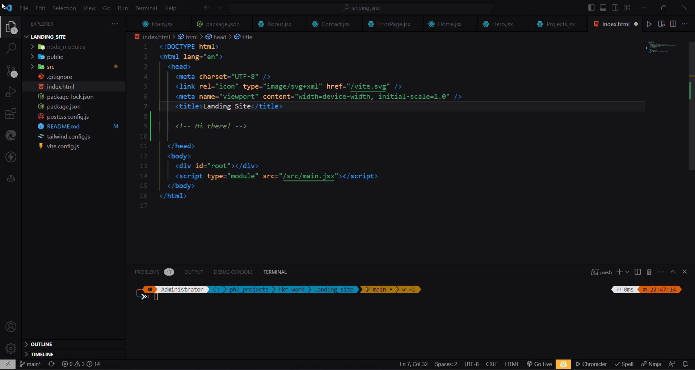

# Vivid Black Theme 
## Bright color code with dark background tailored for personal preference.

  <!--  -->
  
  

Find anything missing ? [create Issues](https://github.com/asmraihan/vivid_black_vscode/issues) so that I can make the theme as compatible as possible ! ❤️ ;)

## 🚀 Installation

- Open the Extensions sidebar in VS Code
- Search for `Vivid Black`
- Click Install
- Open the Theme Palette with Ctrl+K + Ctrl+T or ⇧ k + ⇧ T
- Color Theme and choose `Vivid Black`.

## 📄 License

This theme is released under the MIT License.

 
Published by 
 <a href="https://github.com/asmraihan/" target="_blank">Raihan</a>

<a href="https://github.com/asmraihan/vivid_black_vscode" target="_blank">GitHub repo</a> for this theme

 ### Give a ⭐ if you like it!
